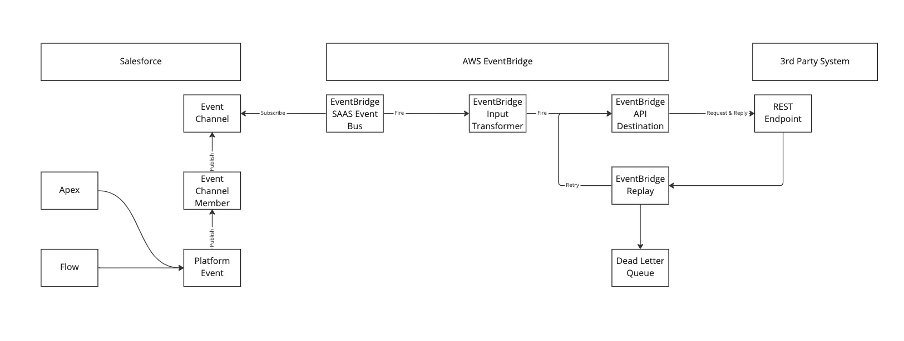
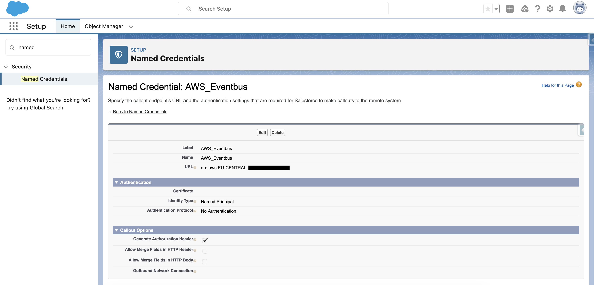
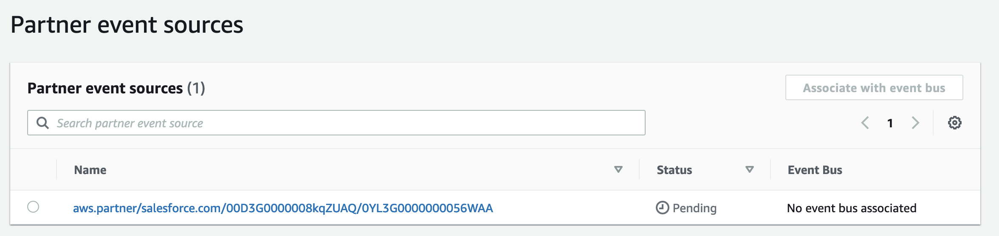
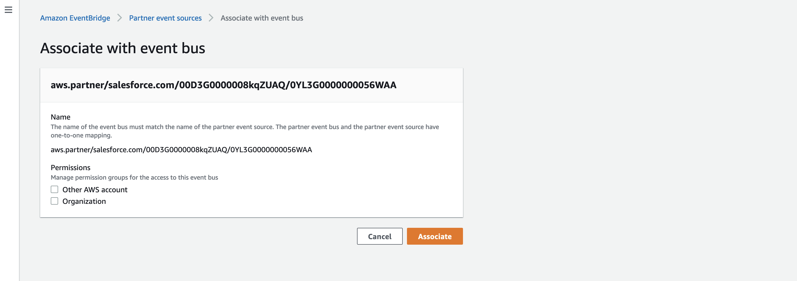
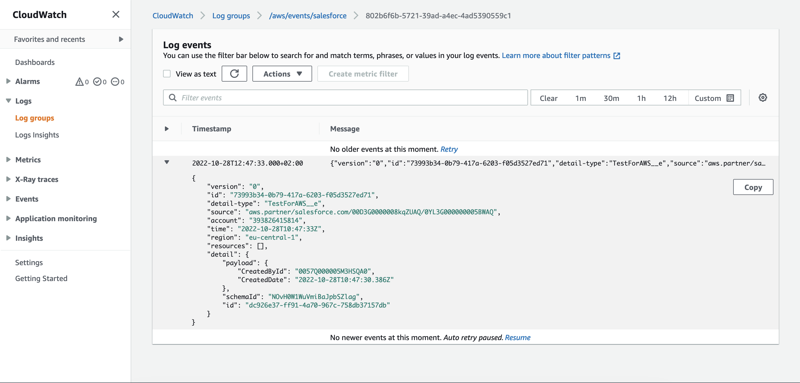

# Salesforce - AWS Eventbus

Proof of Concept to use AWS as a cost-efficient event bus solution for small Salesforce projects

## Introduction
Since Salesforces Winter '23 release, you are able to use a standard connection between Salesforce Core Cloud and Amazon AWS Eventbride. I'll show a simple PoC how to build a stable Pub/Sub channel between the two services. In addition, I'll show an example cost calculation which shows that it's an interesting solution for companies who are already using AWS or don't have a ESB in place yet.

## Advantages
- AWS is pretty cost-efficient compared to other middleware solutions
- AWS can be setup via deployment as it supports Infrastructure As Code (IaC). Therefore, it is a scalable solution to roll out for multiple customer
- Salesforce channel setup can also be deployed or created easy without in-deep integration knowledge
- Pub/Sub (Fire & Forget) integration can easily support error handling and replay of missed events. In that case you don't need to build custom retry mechanism at your REST endpoint. Instead, you can monitor the event propagation in Salesforce and you can use declarative solutions at AWS side like SQS/SNS for deadletter queues.

## Simple Architecture Approach

## Cost Calculation

This calculation is based on the time I needed to implement the PoC. Probably you will need additional time for a productive implementation e.g. for Dead-Letter-Queues or transformation processes. Eventually, you will also implement some consuming 3rd party systems like SAP / ERP or a shop system which also need integration time. Depending on the available endpoints and protocols. 

### Setup Time

| Work Item                                                                  | Time   |
|----------------------------------------------------------------------------|--------|
| Initial Setup per PlatformEventChannel + EventBusRelay                     | ~ 1h   |
| Setup per Salesforce Platform Event incl. Salesforce record-triggered Flow | ~ 1-2h |
| Initial Setup AWS (Account, Access Management, ...)                        | ~ 2h   |
| Setup AWS event handling (no transformation)                               | ~ 2h   |
| Testing                                                                    | ~ 1h   |
|                                                                            |        |
| Sum                                                                        | ~ 8h   |

### Update Time

This is an example use case if e.g. the fields on your object changes or you add additional fields.

| Work Item                                                                  | Time   |
|----------------------------------------------------------------------------|--------|
| Updating Platform Events                                                   | ~ 1h   |
| Updating AWS mapping                                                       | ~ 1h   |
|                                                                            |        |
| Sum                                                                        | ~ 2h   |

### AWS Costs - Example calculation

**Assumption:** 
- Location: EU-Central
- 300.000 Events per Month (10.000 events/24h * 30 days) = Platform Event limit of smaller orgs
- Event-message size: 256KB (~ 250.000 characters)
- Delivery Rate: 99.9% = 3.000 replays
- Simple transformation via EventBridge Input Transformer
- SQS as dead-letter queue

| AWS Service                 | Free Service | Payed Service                   | Quantity       | Monthly Costs |
|-----------------------------|--------------|---------------------------------|----------------|---------------|
| AWS EventBridge             | -            | 1.00$ / 1.000.000 (64kb chunks) | 1,2 Mio events | 1,20$         |
| AWS EventBridge Replay      | -            | 0.12$ / GB                      | 0,768 GB       | 0,09$         |
| AWS EventBridge Destination | -            | 0.24$ / 1.000.000 (64kb chunks) | 1,2 Mio events | 1,20$         |
| AWS SQS                     | 1.000.000    | 0.40$ / 1.000.000               | Free tier      | 0,00$         |
|                             |              |                                 |                |               |
| Sum                         | -            | -                               | -              | 2,49$         |

---

# Setup Guide

## Quickstart
Please read carefully the single steps of the creation process. But, I also added some Quickstart guidance. 
You can use following method which will create a named credential (if not existing), as well as channel, channel member 
and event config relay for a given platform event. 

`AwsEventBridgeBuilderQuickstart.fullSetup(region, arnId, platformEventName)`

## Steps
##### 1. Create a Custom Platform Event (if not existing)
You can create your custom Platform Event from the Saleforce GUI or via Metadata API.

A sample platform event is included in this repo (./force-app/main/default/objects/TestForAWS__e.object-meta.xml).

##### 2. Create a Channel for a Custom Platform Event
You can just use the class "AwsEventBridgeBuilderFacade" from this repo:

`AwsEventBridgeBuilderFacade.createPlatformEventChannel(channelName, label, isDataChannel)`

If you want to create them by your own, you can use Metadata API or Tooling API.

##### 3. Create a Channel Member to Associate the Custom Platform Event
You can just use the class "AwsEventBridgeBuilderFacade" from this repo:

`AwsEventBridgeBuilderFacade.createPlatformEventChannelMember(channelMemberName, channelName, platformEventName)`

If you want to create them by your own, you can use Metadata API or Tooling API.

##### 4. Create named credentials
You can just modify the example named credentials from this repo and deploy them. 

Another option is to create them also via Tooling API. Please use following method:
`AwsEventBridgeBuilderFacade.createNamedCredentials(developerName, label, region, arnId)`

If you want to create them by your own, please use the legacy type of named credentials with following settings: 
- Identity Type = Named Principal 
- Authentication Protocol = No Authentication
- URL = arn:aws:[REGION]:[AWS ACCOUNTID]

##### 5. Create an Event Relay Configuration (via Metadata API, Tooling API or via APEX classe)
You can just use the class "AwsEventBridgeBuilderFacade" from this repo:

`AwsEventBridgeBuilderFacade.createEventRelayConfig(configName, eventChannelAPIName)`

If you want to create them by your own, you can use Metadata API or Tooling API.

##### 6. Activate the Event Bus in AWS Amazon EventBridge
Just browse to EventBridge - Partner Event Sources. You will see your event channel with status "Pending". 

You can now click "Associate" to activate the event source and connect it with your event bus.

I usually associate the bus with CloudWatch to see the event as a log file.

##### 7. Activate Event Relay Configuration (via Metadata API, Tooling API or via APEX classe)
You can just use the class "AwsEventBridgeBuilderFacade" from this repo:

`AwsEventBridgeBuilderFacade.runEventRelayConfig(eventRelayConfigAPIName)`

If you want to run them by your own, you can use Metadata API or Tooling API.

You can check the status of the Bus via: 

`SELECT EventRelayConfig.DeveloperName, Status, ErrorMessage, ErrorTime, ErrorCode FROM EventRelayFeedback`

##### 8. Send test event
Create a sample platform event via FlowBuilder or you can also send one via API or Apex. A sample code for sending one is in the repo called "createPlatformEvent"
[TODO]

If you added the event bus to CloudWatch, you will see the logfile there.

## Future Improvements
- Compare costs for full payload event vs. change event + data retrieve via API
- I will try to build a package to roll out the whole bus via deployment. In that case it scales much better and setup time will be lower
- I implement a monitoring system for the Salesforce-side of the bus

## Limitations
- It just works for me with ChannelTypes = event. Data channel like Change Data Capture should work but didn't for me. Probably we just have to wait for the next update until you can get rid of custom platform events
- Platform events are limited to a size of 1MB. If you want to use larger events, I recommend to just send the ID and changed fields and just query the data from Salesforce in the next step. 
- There is a chance that the EventRelay can fail at Salesforce side and needs to get restarted. I recommend to implement a solution to query the status of the EventRelay, notify your team and try to automatically restart it in case of failure. That could be easy build with scheduled APEX and Tooling API. (Also see Future Improvements)

## Sources
- https://developer.salesforce.com/docs/atlas.en-us.platform_events.meta/platform_events/platform_event_limits.htm
- https://aws.amazon.com/eventbridge/pricing/
- https://aws.amazon.com/sqs/pricing/
- https://help.salesforce.com/s/articleView?id=release-notes.rn_event_bus_relay_pilot.htm&type=5&release=236&language=en_US
