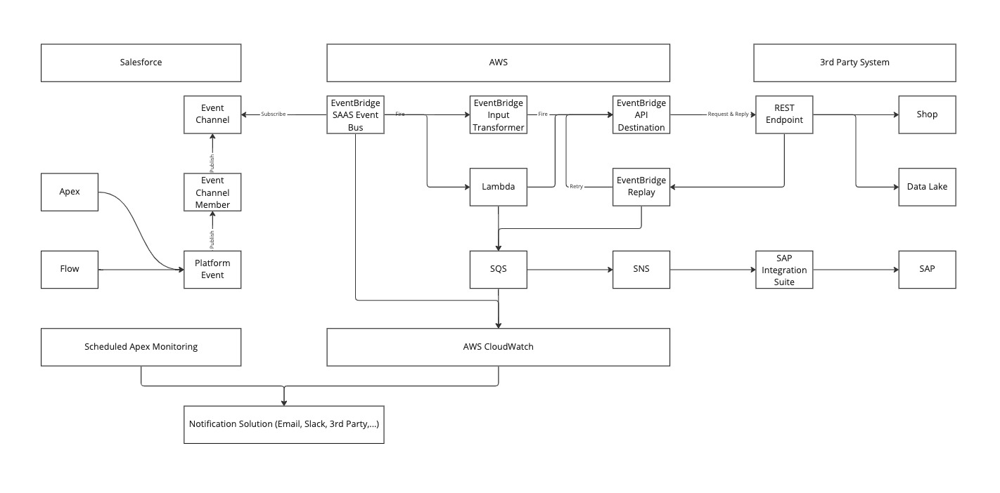

# Salesforce - AWS Eventbus

Proof of Concept to use AWS as a cost-efficient event bus solution for small Salesforce projects

## Introduction
Since Salesforces Winter '23 release, you are able to use a standard connection between Salesforce Core Cloud 
and Amazon AWS EventBridge. I will show a simple PoC on how to set up a stable Pub/Sub channel between the two services. 
In addition, I'll show an example cost calculation which shows that it's an interesting solution for companies 
that are already using AWS or don't have a ESB in place yet.

## Advantages
- AWS is pretty cost-efficient compared to other middleware solutions
- AWS can be setup via deployment as it supports Infrastructure As Code (IaC). Therefore, it is a scalable solution that can be deployed for multiple customer
- Salesforce channel setup can be easily deployed or created even without deep integration knowledge
- Pub/Sub integration (Fire & Forget) can easily support error handling and replay of missed events. In that case you don't need to build a custom retry mechanism on your REST endpoint. Instead, you can monitor the event propagation in Salesforce and you can use declarative solutions at AWS side like SQS/SNS for deadletter queues.

## Simple Architecture Approach

- This is the simplest approach with a platform event triggered from a Salesforce flow or APEX trigger
- EventBridge consumes the event and uses the input transformer to perform simple mappings
- EventBridge performs a callout to a 3rd party REST endpoint
- For error handling, we use EventBridge's built-in retry function and a dead letter queue when the retry limit is reached

## Cost Calculation

This calculation is based on the time it took me to implement the PoC.
You will probably need additional time for a productive implementation, e.g. for dead letter queues or advanced transformation processes.
You may also be implementing other systems such as SAP / ERP or a shop system that also require integration time. 
Depending on the available endpoints and protocols. 

### Setup Time

| Work Item                                                                  | Time   |
|----------------------------------------------------------------------------|--------|
| Initial Setup per PlatformEventChannel + EventBusRelay                     | ~ 1h   |
| Setup per Salesforce Platform Event incl. Salesforce record-triggered Flow | ~ 1-2h |
| Initial Setup AWS (Account, Access Management, ...)                        | ~ 2h   |
| Setup AWS event handling (no transformation)                               | ~ 2h   |
| Testing                                                                    | ~ 1h   |
|                                                                            |        |
| Sum                                                                        | ~ 8h   |

### Update Time

This is an example of a use case when, for example, the fields in your object change or you add additional fields.

| Work Item                                                                  | Time   |
|----------------------------------------------------------------------------|--------|
| Updating Platform Events                                                   | ~ 1h   |
| Updating AWS mapping                                                       | ~ 1h   |
|                                                                            |        |
| Sum                                                                        | ~ 2h   |

### AWS Costs - Example calculation (Full Payload)

**Assumption:** 
- Location: EU-Central
- 300.000 Events per Month (10.000 events/24h * 30 days) = Platform Event limit of smaller orgs
- Event-message size: 256KB (~ 250.000 characters)
- Delivery Rate: 99.9% = 3.000 replays
- Simple transformation via EventBridge Input Transformer
- SQS as dead-letter queue

| AWS Service                 | Free Service | Payed Service                   | Quantity       | Monthly Costs |
|-----------------------------|--------------|---------------------------------|----------------|---------------|
| AWS EventBridge             | -            | 1.00$ / 1.000.000 (64kb chunks) | 1,2 Mio events | 1,20$         |
| AWS EventBridge Replay      | -            | 0.12$ / GB                      | 0,768 GB       | 0,09$         |
| AWS EventBridge Destination | -            | 0.24$ / 1.000.000 (64kb chunks) | 1,2 Mio events | 1,20$         |
| AWS SQS                     | 1.000.000    | 0.40$ / 1.000.000               | 3k events      | 0,00$         |
|                             |              |                                 |                |               |
| Sum                         | -            | -                               | -              | 2,49$         |

### AWS Costs - Example calculation (Change Data Capture)

**Assumption:**
- Change Data Capture = Just the Id and changed fields in event -> Consumer queries the fields by itself
- Location: EU-Central
- 300.000 Events per Month (10.000 events/24h * 30 days) = Platform Event limit of smaller orgs
- Event-message size: 16KB
- Delivery Rate: 99.9% = 3.000 replays
- Simple transformation via EventBridge Input Transformer
- Lambda to fetch data from Salesforce Database (Duration Callout: 5s)
- SQS as dead-letter queue

| AWS Service                 | Free Service          | Payed Service                 | Quantity        | Monthly Costs |
|-----------------------------|-----------------------|-------------------------------|-----------------|---------------|
| AWS EventBridge             | -                     | 1.00$ / mio (64kb chunks)     | 300k events     | 0,30$         |
| AWS EventBridge Replay      | -                     | 0.12$ / GB                    | 0,048 GB        | 0,01$         |
| AWS EventBridge Destination | -                     | 0.24$ / mio (64kb chunks)     | 300k events     | 0,30$         |
| AWS Lambda                  | 1.000.000 - 400k GB/s | 0.20$ / mio - 0.000016$ / GBs | 300k - 234 GB/s | 0,00$         |
| AWS SQS                     | 1.000.000             | 0.40$ / mio                   | 3k events       | 0,00$         |
|                             |                       |                               |                 |               |
| Sum                         | -                     | -                             | -               | 0,61$         |

## More Mature Architecture Approach

- This is the more mature approach compared to the simple approach above
- I would use a scheduled APEX to monitor the event channel and notify when the event propagation or event consuming is below a threshold. I would also monitor the EventRelayConfig if it's still running.
- On AWS side, I would use CloudWatch to monitor the EventBridge and a Dead-Letter-Queue.
- As an example, I've added a common SAP S/4 Hana system which can be connected via the standard SAP Integration Suite connector.
- For more complex transformation processes or perhaps Change-Capture-Data event, I also added AWS Lambda which can perform complex computations in Python, Node or Java.
- In addition, I prefer a queuing approach for the callouts for which I would use SQS + SNS.
- Note: For simplicity, only the Salesforce unidirectional path is shown. Salesforce can also consume from the EventChannel and write back to objects 

---

# Setup Guide

## Quickstart
Please read carefully each step of the creation process. However, I also included a quick start guide. 
You can use following method which will create a named credential (if not existing), as well as a EventChannel, 
EventChannelMember and EventConfigRelay for a given platform event.

Note: 
- Region has to be provide in uppercase (e.g. EU-CENTRAL-1)
- The Platform Event name needs to be provide with ending __e

`AwsEventBridgeBuilderQuickstart.fullSetup(region, arnId, platformEventName)`

## Steps
##### 1. Create a Custom Platform Event (if not existing)
You can create your custom Platform Event from the Saleforce GUI or via Metadata API.

A sample a Platform Event is included in this repo.

##### 2. Create a Channel for a Custom Platform Event
You can simply use the "AwsEventBridgeBuilder" component from this repo:

`AwsEventBridgeBuilderFacade.createPlatformEventChannel(channelName, label, isDataChannel)`

If you want to create them yourself, you can use the Metadata API or the Tooling API.

##### 3. Create a Channel Member to Associate the Custom Platform Event
You can simply use the "AwsEventBridgeBuilder" component from this repo:

`AwsEventBridgeBuilderFacade.createPlatformEventChannelMember(channelMemberName, channelName, platformEventName)`

If you want to create them yourself, you can use the Metadata API or the Tooling API.

##### 4. Create named credentials
You can simply modify the example named credentials from this repo and deploy them via sfdx. 

Another option is to use the "AwsEventBridgeBuilder" component from this repo:
`AwsEventBridgeBuilderFacade.createNamedCredentials(developerName, label, region, arnId)`

If you want to create them yourself, please use the legacy type with following settings: 
- Identity Type = Named Principal 
- Authentication Protocol = No Authentication
- URL = arn:aws:[REGION]:[AWS ACCOUNTID]

##### 5. Create an Event Relay Configuration (via Metadata API, Tooling API or via APEX classe)
You can simply use the "AwsEventBridgeBuilder" component from this repo:

`AwsEventBridgeBuilderFacade.createEventRelayConfig(configName, eventChannelAPIName)`

If you want to create them yourself, you can use the Metadata API or the Tooling API.

##### 6. Activate the Event Bus in AWS Amazon EventBridge
Just go to EventBridge - Partner Event Sources. You will see your event channel with the status "Pending".

You can now click "Associate" to activate the event source and associate it with your event bus.

I usually associate the bus with CloudWatch to see the event as a log file.

##### 7. Activate Event Relay Configuration (via Metadata API, Tooling API or via APEX classe)
You can simply use the "AwsEventBridgeBuilder" component from this repo:

`AwsEventBridgeBuilderFacade.runEventRelayConfig(eventRelayConfigAPIName)`

If you want to activate it by yourself, you can use the Metadata API or the Tooling API.

You can check the status of the EventRelayConfig via: 

`SELECT EventRelayConfig.DeveloperName, Status, ErrorMessage, ErrorTime, ErrorCode FROM EventRelayFeedback`

##### 8. Send test event
Create a sample platform event via FlowBuilder, API or Apex. A sample code for sending the sample event is included in this repo
`SamplePlatformEventPropagation.publishSamplePlatformEvent()`

If you added the event bus to CloudWatch, you will see the logfile there.

## Limitations
- For me it works only with ChannelTypes = event. Data channels like Change Data Capture should work, but it didn't work for me. Probably we just have to wait for the next update until you can get rid of the custom platform events
- Platform events are limited to a size of 1MB. If you want to use larger events, I recommend to just send the ID and changed fields and just query the data from Salesforce in the next step. 
- There is a possibility that the EventRelay on the Salesforce side will fail and need to be restarted. I recommend implementing a solution that queries the status of the EventRelay, notifies your team, and attempts to restart it automatically if it fails. This could be easily created using APEX and the Tooling API.

## Sources
- https://developer.salesforce.com/docs/atlas.en-us.platform_events.meta/platform_events/platform_event_limits.htm
- https://developer.salesforce.com/docs/atlas.en-us.platform_events.meta/platform_events/platform_events_monitor_usage.htm
- https://help.salesforce.com/s/articleView?id=release-notes.rn_event_bus_relay_pilot.htm&type=5&release=236&language=en_US
- https://api.sap.com/package/AmazonWebServicesAdapter/overview
- https://aws.amazon.com/eventbridge/pricing/
- https://aws.amazon.com/sqs/pricing/
- https://docs.aws.amazon.com/lambda/latest/dg/getting-started.html
- https://docs.aws.amazon.com/AmazonCloudWatch/latest/monitoring/WhatIsCloudWatch.html